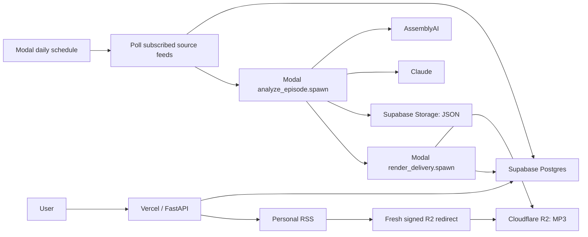

# Automatic Podcast Feed Editing: Lean Backend Plan

Status: revised proposal for technical and legal sanity check
Date: 2026-07-20  
Audience: product, engineering, infrastructure, security, and legal reviewers

## 1. Decision summary

Build the 5–10 user beta with four services:

- **Vercel + FastAPI:** user-facing subscription APIs, account UI, status, and personal RSS routes.
- **Supabase Postgres:** subscriptions, canonical source episodes, durable processing state, uniqueness,
  and subscriber deliveries.
- **Modal:** one daily scheduled poller plus serverless Python functions for analysis and native-FFmpeg
  rendering. Modal supplies execution, retries, timeouts, logs, and scale-to-zero.
- **Cloudflare R2:** final MP3 enclosures. Keep transcript/highlight JSON in Supabase Storage.

Keep AssemblyAI and Claude for V1. Do not add generated voice. Use the existing 0.5-second silent
transition by default.

This revision deliberately removes:

- An always-on worker.
- Supabase Cron and the Vercel cron-dispatch endpoint.
- A hand-built Postgres queue with leases, heartbeats, and a sweeper.
- Internal poll/sweep APIs.
- A `processing_events` table.
- A large metrics/alerts program and phase-gate process.

Modal retries do **not** replace database idempotency. Supabase remains the durable record of what has
happened; every Modal function is re-entrant and safe to execute more than once.

## 2. Why this architecture

The current application renders in the browser with ffmpeg.wasm. Automatic subscriptions have no open
browser and need native FFmpeg in a process that can run for minutes or hours. Modal supports scheduled
Python functions, per-function retries, scale-to-zero, and function timeouts up to 24 hours. That is a
better fit for beta volume than operating a persistent worker and distributed lease protocol.

Published MP3 traffic behaves differently from compact application artifacts: podcast clients may
download full enclosures repeatedly. R2 Standard storage currently includes 10 GB-month, 1 million
Class A operations, 10 million Class B operations, and direct egress without transfer fees. Supabase's
current free tier includes 1 GB file storage and 5 GB each of cached and uncached egress; paid overage
is tied to bandwidth. R2 therefore isolates enclosure growth from the database/storage provider.

Pricing snapshot, verified 2026-07-20; recheck before implementation:

- [Modal pricing](https://modal.com/pricing): Starter includes $30/month compute credit, up to 100
  containers, and pay-per-second CPU/memory billing.
- [Modal schedules](https://modal.com/docs/guide/cron),
  [retries](https://modal.com/docs/guide/retries), and
  [timeouts](https://modal.com/docs/guide/timeouts).
- [Cloudflare R2 pricing](https://developers.cloudflare.com/r2/pricing/).
- [Supabase pricing](https://supabase.com/pricing) and
  [egress documentation](https://supabase.com/docs/guides/platform/manage-your-usage/egress).

## 3. Product definition

A signed-in user subscribes to a public RSS feed and chooses an automatic editing recipe. Once daily,
the system discovers new episodes, creates one shared transcript/highlight analysis per canonical
episode, produces a subscriber-specific edit, verifies it, stores it in R2, and adds it to the user's
personal RSS feed.

### V1 recipe

- Target duration: 15, 30, 45, or 60 minutes; default 30.
- All topics or a saved subset.
- Minimum highlight score; default 7.
- Pause between highlights: none, 0.5 seconds, or 1 second; default 0.5.
- Start policy: future episodes only, or process the newest current episode once.
- Active or paused.

### V1 selection policy

1. Reject malformed or empty candidates.
2. Filter by selected topics and minimum score.
3. Rank by score, then Claude's editorial order.
4. Add complete highlights until the target duration is reached.
5. Permit one complete highlight to exceed the target; never truncate a highlight.
6. Remove substantial time-range overlaps.
7. Restore chronological order for playback.
8. If none qualify, mark the delivery `no_matching_highlights` and publish nothing.

Store `recipe_snapshot` and `selection_policy_version` on every delivery. Changing a subscription only
affects future episodes.

## 4. Goals and non-goals

### Goals

- New eligible episodes require no browser or manual editing.
- Shared source analysis runs once even when several users subscribe to the same podcast.
- Duplicate schedules, retries, and function crashes cannot create duplicate RSS items.
- No RSS entry is published until its MP3 passes media and storage verification.
- Five invited users can use the feature for two weeks without operator intervention.
- Hard caps bound transcription, analysis, rendering, storage, and egress exposure.

### Non-goals

- No voice cloning, spoken transitions, or AI-written bridges.
- No authenticated, DRM-protected, or private source feeds.
- No historical full-catalog import.
- No natural-language recipes.
- No re-analysis workflow when `analysis_version` changes. Keep the column only.
- No paid tier or faster-than-daily polling in V1.
- No bespoke workflow engine, durable queue product, or audit-event subsystem.

## 5. Blocking legal/product question

Before a public launch, obtain an explicit legal review of automatically creating and serving derivative
edits of third-party podcast audio. The intended posture is private, per-user personal-use time-shifting,
but that is a product description—not a legal conclusion. Review source-feed terms, copyright exposure,
retention, takedown handling, and whether any publisher opt-out is required.

For the invited beta:

- Support only publicly downloadable RSS enclosures.
- Keep feeds private and token-gated.
- Do not market or expose edited files publicly.
- Document a takedown path.
- Record the source feed and enclosure for every output.

This is the only blocking non-engineering decision. Ad removal is best-effort model judgment in V1 and
must be described that way.

## 6. Architecture

### Service boundaries

#### Vercel/FastAPI

- Authenticate users and enforce ownership.
- Create, update, pause, and delete subscriptions.
- Display delivery status and actionable failures.
- Serve personal RSS XML.
- For enclosure GET/HEAD, create a short-lived signed R2 URL and redirect; do not proxy MP3 bytes.
- Optionally request an immediate Modal retry after the beta proves a need. Daily reconciliation is
  sufficient initially.

#### Supabase

- Store all durable control state and uniqueness constraints.
- Store compact transcript/highlight JSON artifacts.
- Remain authoritative when Modal call outputs/logs expire.
- Do not act as a work queue and do not store final podcast enclosures.

#### Modal

- Run the daily scheduled poller.
- Spawn one analysis call per newly discovered canonical episode.
- Wait/poll for AssemblyAI inside the analysis call for V1, persisting the provider ID first.
- Spawn subscriber-specific render calls after analysis is ready.
- Run native FFmpeg and ffprobe in an image with pinned versions.
- Apply retries, timeouts, and conservative `max_containers` limits.

Waiting for AssemblyAI consumes some Modal memory allocation. This is accepted at beta scale because it
removes another callback/poller workflow. Revisit provider webhooks or split submission/polling only if
measured cost or timeout behavior warrants it.

#### Cloudflare R2

- Store only verified final MP3s and short-lived temporary render uploads.
- Use the S3-compatible API from Modal and Vercel.
- Keep the bucket private.
- Apply lifecycle deletion to abandoned temporary objects after 48 hours.
- Delete published objects after 90 days and remove their RSS items in the same retention job.

## 7. Minimal data model

Use four new tables. Enable and force RLS; revoke browser roles; expose only service-side operations.

### `source_feeds`

- `id`
- `normalized_url` — unique
- `title`
- `etag`, `last_modified`
- `last_polled_at`, `last_poll_error`
- `created_at`, `updated_at`

### `feed_subscriptions`

- `id`
- `user_id`
- `source_feed_id`
- `status` — `active`, `paused`, `deleted`
- `recipe_json`
- `start_after` — prevents historical import
- `created_at`, `updated_at`

Constraint: one non-deleted subscription per `(user_id, source_feed_id)`.

### `source_episodes`

This row also holds shared analysis state; no separate analysis-job table is needed for V1.

- `id`
- `source_feed_id`
- `rss_guid`
- `identity_hash` — unique
- `enclosure_url`, `enclosure_url_hash`
- `title`, `published_at`, `language`
- `analysis_status` — `queued`, `analyzing`, `ready`, `failed`
- `analysis_version`
- `assemblyai_transcript_id`
- `transcript_storage_path`, `highlights_storage_path`
- `analysis_attempts`, `analysis_error_code`
- `created_at`, `updated_at`

Identity precedence:

1. Hash of normalized feed identity plus a non-empty RSS GUID.
2. Otherwise hash of normalized feed identity plus normalized enclosure URL.
3. Publication date and title are metadata, never primary identity.

Keep `analysis_version`, but do not build automatic re-analysis on version changes.

### `subscription_deliveries`

- `id`
- `subscription_id`, `source_episode_id`
- `job_id` — unique reference to an existing `jobs` row for current account/history/RSS compatibility
- `status` — `waiting`, `processing`, `published`, `no_matching_highlights`, `failed`
- `recipe_snapshot_json`, `selection_policy_version`
- `selected_highlight_ids_json`
- `expected_duration_seconds`
- `modal_call_id` — diagnostic only, not durable truth
- `attempts`, `last_error_code`
- `r2_object_key`, `output_size_bytes`, `output_duration_seconds`, `output_sha256`
- `published_at`, `created_at`, `updated_at`

Constraint: unique `(subscription_id, source_episode_id)`.

Create the subscriber-owned `jobs` row when inserting the delivery, using existing job states for the
account UI (`queued`, `splicing`, `done`, `error`). Reuse the existing personal feed/item tables with
that `job_id`. A delivery publishes at most one item. This avoids a second RSS item model and keeps old
download/account routes compatible while `subscription_deliveries` holds the automatic workflow detail.

## 8. Idempotency without a queue subsystem

Modal execution is at least once. Correctness comes from deterministic keys, unique constraints,
conditional updates, and re-entrant functions:

- `source_episodes.identity_hash` prevents duplicate discovery.
- `(subscription_id, source_episode_id)` prevents duplicate deliveries.
- `assemblyai_transcript_id` is stored immediately after submission; a retry reuses it.
- Transcript/highlight artifact keys derive from source episode ID and analysis version.
- Final R2 object keys derive from delivery ID and recipe version.
- Each delivery has one subscriber-owned job row; personal feed items remain unique per account feed
  and delivery job.
- Publication uses a transaction and is always the final state change.
- A function first inspects database state and existing artifacts, then resumes from the first missing
  stage rather than restarting blindly.

Use guarded updates such as `UPDATE ... WHERE status IN (...)`, but do not implement leases or
heartbeats. Two duplicate render calls may occasionally perform redundant compute; they must converge
on one verified object/feed item. At beta volume, accepting rare duplicate compute is cheaper than
building distributed exclusion machinery.

Do not rely on Modal Queue objects as durable state; Modal documents that their persistence is not
guaranteed and their default partition TTL is 24 hours. Postgres rows remain authoritative.

## 9. End-to-end flow

### A. Daily Modal schedule

1. Query active subscriptions and group them by `source_feed_id`.
2. Poll each distinct feed once with saved ETag/Last-Modified headers.
3. Enforce SSRF, DNS/IP, redirect, response-size, timeout, and entry-count limits.
4. Upsert new canonical source episodes.
5. Insert eligible subscriber delivery/job pairs transactionally with `ON CONFLICT DO NOTHING`.
6. Spawn `analyze_episode(source_episode_id)` only for episodes not already ready/current.
7. Reconcile incomplete rows: respawn eligible `queued`, `analyzing`, `waiting`, or `processing` work
   older than the configured threshold.

Limit one scheduled poller with bounded fan-out. Set an explicit Modal `max_containers` rather than
allowing the account maximum.

### B. Shared analysis function

`analyze_episode(source_episode_id)` is re-entrant:

1. Return if current-version transcript and highlight artifacts are already validated.
2. Resolve and validate the public enclosure URL again.
3. If no AssemblyAI provider ID exists, submit once and persist the returned ID immediately.
4. Poll AssemblyAI with bounded backoff until complete or the function timeout approaches.
5. Save and validate transcript JSON in Supabase Storage.
6. Call Claude for the exhaustive complete-thought highlight library.
7. Validate JSON, ranges, topics, and scores; store the artifact.
8. Mark the source episode `ready` through a guarded update.
9. Spawn `render_delivery(delivery_id)` for each waiting delivery.

Retry transient failures through Modal. Persist stable error codes and increment attempts. On retry,
reuse provider IDs and artifacts. After the configured maximum, mark `failed`; the daily reconciler does
not respawn permanent failures.

### C. Delivery render function

`render_delivery(delivery_id)` is re-entrant:

1. Return if already published.
2. Require ready shared analysis.
3. Run the deterministic selection policy and persist selected IDs.
4. If nothing qualifies, mark `no_matching_highlights`.
5. Reject impossible output-size estimates before downloading source audio.
6. Download the public enclosure through the hardened fetcher.
7. Extract complete ranges with native FFmpeg and existing padding.
8. Normalize clips to a common sample rate/channel layout.
9. Insert the configured silent transition only between clips.
10. Concatenate chronologically and encode MP3 at the highest bitrate that fits the size policy.
11. Run ffprobe and SHA-256 locally.
12. Upload to a unique temporary R2 key.
13. Verify R2 HEAD, size, MIME, and a ranged read.
14. Copy/promote to the deterministic final key.
15. In one database transaction, mark `published` and insert/update the personal RSS item.
    Mark the associated job `done` with its R2 storage key and verified size in the same transaction.
16. Delete the temporary object.

Use subprocess argument arrays. Never interpolate user text into shell commands, filenames, FFmpeg
filters, R2 keys, or logs.

### D. RSS enclosure delivery

1. Personal RSS continues to expose an application enclosure URL.
2. GET/HEAD verifies the private feed token and delivery membership.
3. The route generates a fresh, short-lived R2 signed URL and returns a redirect.
4. The podcast application downloads directly from R2.

Generate method-appropriate signatures for GET and HEAD, and preserve existing job/output route
compatibility by selecting the storage backend from the job's output metadata. Test redirect, HEAD,
Range, content-length, and MIME behavior in Apple Podcasts, Pocket Casts,
Overcast, and AntennaPod before beta.

## 10. Failure handling

Use Modal retries with exponential backoff for function-level transient failures. Application state
classifies whether re-entry may continue.

| Failure | V1 behavior |
|---|---|
| RSS timeout, 429, or 5xx | Save error; daily schedule retries next day |
| RSS 404/410 | Pause source after 3 consecutive daily failures |
| AssemblyAI transient error | Modal retry; reuse persisted provider ID |
| Claude timeout/rate limit/incomplete JSON | Modal retry; maximum 5 attempts |
| Source audio 401/403/404 | One retry, then permanent delivery failure |
| FFmpeg failure | Two retries in fresh containers |
| R2 upload failure | Retry with same delivery and a new temporary key |
| Verification mismatch | Delete temporary object; rerender once |
| Publication transaction failure | Retry publication without rerendering verified final object |

The daily schedule is also the simple reconciler. It looks for non-terminal rows older than 24 hours
and respawns only those still under attempt limits. No lease sweeper is required.

## 11. Security and privacy

- Public RSS enclosures only for source audio.
- Reuse existing bounded HTTP fetch, DNS/IP pinning, redirect revalidation, and SSRF denial logic.
- Keep R2 private; issue short-lived signed redirects only after personal-feed authorization.
- Put Supabase, AssemblyAI, Anthropic, and R2 credentials in Modal Secrets and the minimum necessary
  Vercel environment variables.
- Never include signed URLs, tokens, credentials, full provider responses, or transcript text in logs.
- Apply and force RLS; revoke `anon` and `authenticated` access to new tables.
- Validate recipe JSON and version it.
- Sanitize errors before persistence/UI display.
- Cap source duration, output duration, subscriptions, new episodes/day, retries, and object size.
- Delete abandoned temporary R2 objects after 48 hours.
- Remove 90-day-old final objects and their RSS rows together so feeds never point to deleted audio.
- Retain transcripts/highlights indefinitely for reuse only if legal review approves; otherwise choose a
  fixed retention period before beta.

## 12. Cost controls and retention

Environment-configured launch caps:

- 5 active subscriptions per user.
- 3 new episodes per subscription per day.
- Future-only by default.
- 6-hour maximum source duration.
- 60-minute maximum target output.
- 5 Modal render containers maximum initially.
- 5 analysis attempts and 3 render attempts.
- Global source-minutes/day cap; defer excess work rather than dropping it.

Retention:

- Transcript/highlight JSON: indefinite pending legal approval.
- Published MP3 and corresponding RSS item: 90 days rolling.
- Failed temporary R2 objects: 48 hours.
- Database delivery metadata: retain after object expiry for debugging and usage history.

Track only the units needed to catch cost surprises:

- Source minutes submitted to AssemblyAI.
- Claude input/output tokens.
- Modal CPU-seconds and memory-seconds.
- R2 stored GB, Class A writes, and Class B reads.
- Published output minutes.

Do not build a budgeting subsystem for beta. Review provider dashboards and one SQL summary weekly.

## 13. Minimal observability and operations

Use Modal's dashboard/logs plus database status fields.

Required checks:

1. Alert if the daily scheduled function has no successful run in 26 hours.
2. Daily SQL query for non-terminal source episodes or deliveries older than 24 hours.
3. Modal failure notification/dashboard review during beta.

Required controls:

- Global environment flag disabling new automatic processing.
- Per-subscription pause.
- User-visible retry that marks a failed row eligible; the next schedule respawns it. Add immediate
  Modal spawning only if daily retry latency becomes a real problem.

No event table, queue-depth dashboard, drain mode, lease monitoring, or stage-level alert suite in V1.

## 14. Testing plan

### Unit tests — required

- Canonical feed URL and episode identity hashing.
- GUID-first/enclosure-fallback behavior under feed mutation.
- Recipe validation and immutable snapshots.
- Score/topic filtering, overlap removal, duration target, and chronological output order.
- Idempotent state-resume decisions.
- Output duration/size estimates including transitions.

### Database integration tests — required

- Duplicate poll inputs produce one source episode and one delivery.
- Guarded status transitions do not regress terminal state.
- Duplicate publication produces one RSS item.
- RLS blocks browser roles from all new tables.

### Real media fixtures — required

Use three representative podcasts rather than a large synthetic matrix:

1. A long, large, variable-bitrate episode.
2. A mono/non-44.1kHz episode with multiple speakers.
3. An episode whose host/range behavior has previously failed in production.

For each, verify ffprobe duration tolerance, transitions, chronological order, size, R2 HEAD/Range,
and playback through the personal RSS route.

### End-to-end beta checks — required

- Controlled feed publishes one episode without an open browser.
- Re-running the daily poll creates no duplicate output or RSS item.
- Forced Modal retry resumes without resubmitting completed provider stages.
- Failed verification publishes nothing.
- Production smoke checks the newest three enclosures.

Do not build concurrent-lease tests because V1 has no lease subsystem.

## 15. Concrete implementation plan

Expected effort: approximately 8–12 focused engineering days, followed by a two-week invited beta.

### Step 1: settle blockers and accounts — 0.5 to 1 day

- Obtain initial legal/product review.
- Create Modal workspace/secrets and R2 private bucket/API credentials.
- Confirm R2 signed redirect compatibility with target podcast apps using one test object.
- Lock launch caps and retention.

Exit: legal beta posture documented and R2 delivery spike passes.

### Step 2: schema and core logic — 1 to 1.5 days

- Add four tables, constraints, indexes, RLS, and retention fields.
- Extract canonical identity and automatic selection into pure, versioned functions.
- Add unit and database regression tests.

Exit: duplicate discovery/delivery tests pass.

### Step 3: Modal foundation and polling — 1 to 1.5 days

- Add `modal_app.py`, pinned Python dependencies, FFmpeg/ffprobe image, and secrets.
- Add daily scheduled function and bounded feed fan-out.
- Reuse hardened feed fetching and conditional request metadata.

Exit: fixture feed discovery is idempotent across repeated runs.

### Step 4: shared analysis — 1 to 1.5 days

- Implement re-entrant AssemblyAI submit/poll and Claude analysis.
- Persist provider ID before waiting and artifacts before status transitions.
- Configure retries, timeouts, attempt caps, and `max_containers`.

Exit: a forced retry reuses the AssemblyAI job and completes once.

### Step 5: rendering, R2, and publication — 2 to 3 days

- Implement selection, native FFmpeg rendering, transitions, ffprobe, checksums, and bitrate policy.
- Add R2 temporary/final upload and verification.
- Add transactional RSS publication and R2 redirecting enclosure routes.
- Run the three real media fixtures.

Exit: no feed item can reference a missing/unverified object.

### Step 6: subscription UI/API — 1 to 1.5 days

- Add subscription CRUD and status/history UI.
- Add pause and retry eligibility.
- Enforce quotas and future-only default.

Exit: a signed-in user can subscribe and understand every terminal/error state.

### Step 7: invited beta — two weeks elapsed

- Run for the owner plus five invited users.
- Review stuck-work SQL and provider dashboards daily for the first week.
- Fix repeated failure classes; do not add infrastructure for one-off failures.

Exit: automatic editing works for two weeks without manual intervention, produces no duplicate RSS
items, and never publishes an unverifiable enclosure.

## 16. V1 acceptance criteria

- One daily Modal schedule polls every distinct active source feed at most once per run.
- Duplicate schedule execution creates no duplicate source episode, delivery, object, or RSS item.
- Multiple subscribers share one current-version transcript/highlight artifact set.
- Automatic selection preserves complete highlights and final chronological order.
- A function retry resumes from persisted provider/artifact state.
- Failed rendering, upload, or verification publishes no RSS item.
- Podcast clients can follow the application enclosure URL through a fresh signed R2 redirect.
- Paused subscriptions create no future deliveries.
- Hard caps stop or defer expensive work before provider submission.
- The owner and five invited users operate for two weeks without manual pipeline intervention.

## 17. Decisions now resolved

- **Compute:** Modal serverless functions and one daily Modal schedule.
- **Published storage:** private Cloudflare R2 with signed redirects.
- **Database:** Supabase Postgres, used for durable state—not as a queue.
- **Transcription:** AssemblyAI for V1; evaluate faster-whisper on Modal only after measuring economics.
- **Recipe:** score-first selection, chronological playback, default 30 minutes.
- **Sources:** public RSS enclosures only.
- **Polling:** daily only.
- **Transitions:** silent, default 0.5 seconds.
- **Ads:** Claude best-effort exclusion only.
- **Retention:** MP3/RSS 90 days, temp objects 48 hours, analysis artifacts pending legal decision.
- **Re-analysis:** retain version columns, build no version-bump workflow.

## 18. Remaining reviewer questions

1. Is the private personal-use beta posture acceptable pending formal public-launch legal review?
2. Does deleting both MP3 and RSS item after 90 days match the expected listener experience?
3. Are Modal Starter's one-day logs sufficient, or should errors be copied into a stable database field
   with slightly more detail?
4. Does waiting inside Modal for AssemblyAI remain cheaper/simpler than provider webhook plumbing at
   observed episode durations?
5. Is accepting rare duplicate render compute—while guaranteeing one publication—the right beta
   trade-off?
6. Do the initial five-container cap and daily source-minute cap provide adequate spend protection?
7. Does R2 signed-URL redirect behavior work reliably in every target podcast client?

## 19. Explicit triggers to revisit the architecture

Add more infrastructure only when one of these occurs:

- More than 100 automatic deliveries/day or sustained Modal concurrency pressure.
- Duplicate compute becomes a meaningful portion of spend.
- Daily reconciliation leaves work stuck or retries too slowly.
- AssemblyAI waiting materially consumes the compute credit.
- Beta support cannot be handled from status/error fields and Modal logs.
- R2 signing redirects fail in a meaningful podcast client.
- A compliance requirement demands longer audit logs or a formal event trail.

At that point evaluate provider webhooks, a durable managed workflow/queue, richer observability, and
GPU transcription. None is required to validate the current product hypothesis.
