# Automatic Podcast Feed Editing: Backend Processing Plan

Status: proposed for technical review  
Date: 2026-07-20  
Audience: product, backend, infrastructure, security, and audio-engineering reviewers

## 1. Executive summary

Users should be able to subscribe to a source podcast once and receive automatically shortened,
highlight-only versions of future episodes in their personal RSS feed. The system should poll source
feeds daily, reuse transcript and highlight analysis across subscribers, apply each subscriber's
editing recipe, render a verified MP3 without an open browser, and publish it exactly once.

The recommended architecture is:

- Keep Vercel/FastAPI as the synchronous control plane and user-facing API.
- Keep Supabase Postgres and Storage as the system of record.
- Use Supabase Cron for the daily scheduler, calling a secured Vercel dispatch endpoint.
- Treat Postgres tables plus atomic claim functions as the durable work queue for the MVP.
- Add a separately deployed, continuously runnable Python worker with native FFmpeg and ffprobe.
- Continue using AssemblyAI for transcription and Claude for the shared highlight library.
- Render subscriber-specific outputs only after shared analysis is complete.
- Publish to personal RSS only after storage and media verification succeeds.

The first release should not generate spoken transitions. It should use the existing configurable
silent transition and a simple, deterministic highlight-selection recipe.

## 2. Problem statement

The current product requires a user to choose highlights and keep a browser open while ffmpeg.wasm
creates the final MP3. That cannot support unattended processing of newly published podcast episodes.
It also repeats work if multiple users edit the same source episode.

The backend needs to separate shared source analysis from subscriber-specific selection and rendering,
while guaranteeing that retries, overlapping polls, malformed feeds, and partial uploads never create
duplicate or broken RSS entries.

## 3. Goals

### User goals

1. A subscriber receives a playable edited episode without returning to the website.
2. A source episode appears in the personal feed no more than 24 hours after discovery under normal
   provider availability.
3. Every output contains complete highlights, remains within the configured duration policy, and plays
   in major podcast applications.
4. A user can see whether each episode is detected, analyzing, rendering, published, or failed.
5. A user can pause a subscription and retry a failed episode.

### System goals

1. Transcribe and analyze each canonical source episode once, regardless of subscriber count.
2. Make feed discovery, analysis, rendering, and publication idempotent.
3. Recover automatically from process termination and transient provider failures.
4. Enforce per-user and global cost limits before expensive work begins.
5. Preserve the current manual editing workflow while the automatic workflow is introduced.

## 4. Non-goals for V1

- No cloned host or guest voices.
- No AI-written spoken transitions.
- No historical full-catalog imports; subscriptions default to future episodes only.
- No arbitrary natural-language editing recipes.
- No guarantee that an episode is available at an exact wall-clock time.
- No attempt to process DRM-protected, authenticated, or non-downloadable audio.
- No replacement of the existing manual browser editor.

## 5. Product behavior

### Subscription recipe

V1 exposes these settings:

- Source RSS URL.
- Target duration: 15, 30, 45, or 60 minutes.
- Topic mode: all topics or a saved subset.
- Minimum highlight score: default 7.
- Pause between highlights: none, 0.5 seconds, or 1 second.
- Start policy: future episodes only, or process the newest current episode once.
- Active or paused.

### Selection policy

For each subscriber delivery:

1. Discard malformed, empty, or overlapping duplicate candidates.
2. Filter by configured topics and minimum score.
3. Rank by score, then editorial importance order returned by the analysis model.
4. Add complete highlights until the target duration is reached.
5. Permit exceeding the target by one complete highlight; never truncate a highlight to hit the target.
6. Remove candidates whose time range substantially overlaps an already selected candidate.
7. Restore chronological source order for final playback.
8. Require at least one selected highlight; otherwise mark the delivery `no_matching_highlights` and do
   not publish an empty episode.

The policy version is stored with every delivery so future algorithm changes do not silently alter
retries of an existing delivery.

## 6. High-level architecture

```mermaid
flowchart LR
    Cron["Supabase Cron: daily"] --> Dispatch["Vercel dispatch API"]
    Dispatch --> Subscriptions["Claim due subscriptions"]
    Subscriptions --> Fetch["Bounded RSS fetch"]
    Fetch --> Episodes["Canonical source episodes"]
    Episodes --> AnalysisQueue["Shared analysis jobs"]
    AnalysisQueue --> Providers["AssemblyAI + Claude"]
    Providers --> Library["Transcript + highlight library"]
    Library --> DeliveryQueue["Subscriber deliveries"]
    DeliveryQueue --> Worker["Native FFmpeg worker"]
    Worker --> Storage["Supabase private storage"]
    Storage --> Verify["ffprobe + storage verification"]
    Verify --> FeedItems["Personal RSS items"]
```

### Component responsibilities

#### Vercel/FastAPI control plane

- Subscription CRUD and account authorization.
- Cron authentication and lightweight dispatch.
- Status APIs and personal RSS serving.
- Feed URL validation and SSRF protections shared with manual ingestion.
- No long-running audio processing.

#### Supabase Postgres

- Subscription, source episode, analysis, and delivery state.
- Atomic job claiming, leases, uniqueness constraints, retry timestamps, and audit history.
- Durable coordination between stateless APIs and workers.

#### Supabase Storage

- Shared transcript and highlight artifacts.
- Subscriber-specific rendered MP3s.
- Temporary render uploads, promoted only after verification.

#### Native media worker

- Claims one runnable task at a time through an atomic database function.
- Downloads or streams approved source audio.
- Runs native FFmpeg/ffprobe.
- Inserts silent transitions and performs final encoding.
- Uploads to a temporary object, verifies it, then marks the delivery publishable.
- Sends lease heartbeats and records structured progress.

## 7. Why a separate worker is required

Browser ffmpeg.wasm requires an active user session and has repeatedly encountered memory, timeout,
range-fetch, and upload constraints on large episodes. Vercel cron invocations have the same duration
limits as Vercel Functions and are not retried automatically. Vercel also documents that cron events
can overlap or be delivered more than once, requiring explicit locking and idempotency.

The scheduler should therefore enqueue bounded work and return quickly. Native audio processing belongs
in a worker environment with FFmpeg, persistent execution, controllable memory, and no browser lifecycle.

References:

- [Vercel Cron management](https://vercel.com/docs/cron-jobs/manage-cron-jobs)
- [Supabase Cron](https://supabase.com/docs/guides/cron)

## 8. Proposed data model

All tables use UUID primary keys, timestamps, RLS, service-role-only mutation, and explicit indexes for
claim queries.

### `feed_subscriptions`

| Column | Purpose |
|---|---|
| `id` | Subscription identity |
| `user_id` | Better Auth user |
| `feed_url` | Original submitted URL |
| `normalized_feed_url` | Canonical deduplication URL |
| `title` | Display title |
| `status` | `active`, `paused`, `error`, `deleted` |
| `recipe_json` | Validated, versioned editing recipe |
| `etag` / `last_modified` | Conditional HTTP polling |
| `last_polled_at` | Most recent attempt |
| `next_poll_at` | Scheduler eligibility |
| `consecutive_failures` | Backoff and UI state |
| `last_error_code` | Stable, non-secret error classification |
| `created_at` / `updated_at` | Audit timestamps |

Constraints:

- Unique active subscription on `(user_id, normalized_feed_url)`.
- `recipe_json` validated by the API before storage.
- Index on `(status, next_poll_at)`.

### `source_feeds`

Stores one shared record per normalized feed URL, including conditional request metadata. Multiple user
subscriptions reference the same source feed.

### `source_episodes`

| Column | Purpose |
|---|---|
| `id` | Canonical episode identity |
| `source_feed_id` | Parent source feed |
| `rss_guid` | Original GUID when supplied |
| `identity_hash` | Stable deduplication key |
| `enclosure_url` | Validated audio URL |
| `enclosure_url_hash` | Secondary deduplication key |
| `title`, `published_at`, `language` | Episode metadata |
| `analysis_job_id` | Shared analysis job |
| `created_at` / `updated_at` | Audit timestamps |

Identity precedence:

1. Hash of feed identity plus non-empty RSS GUID.
2. Otherwise hash of feed identity plus normalized enclosure URL.
3. Publication date and title are metadata, not primary identity.

### `analysis_jobs`

One per source episode and analysis-policy version.

State: `queued -> transcribing -> detecting_highlights -> ready`, with `retry_wait`, `failed`, and
`cancelled` terminal/side states.

Important columns:

- `source_episode_id`, `analysis_version`, `status`.
- Provider IDs and artifact paths.
- `attempt_count`, `next_attempt_at`.
- `lease_owner`, `lease_expires_at`, `heartbeat_at`.
- `error_code`, sanitized `error_detail`.
- Unique `(source_episode_id, analysis_version)`.

### `subscription_deliveries`

One subscriber-specific output per source episode and recipe version.

State: `waiting_for_analysis -> queued -> selecting -> rendering -> verifying -> published`, with
`retry_wait`, `no_matching_highlights`, `failed`, and `cancelled` states.

Important columns:

- `subscription_id`, `source_episode_id`, `analysis_job_id`.
- Immutable `recipe_snapshot_json` and `selection_policy_version`.
- Selected highlight IDs and expected duration.
- Output storage path, size, duration, bitrate, and checksum.
- Lease, retry, progress, and error fields matching analysis jobs.
- Unique `(subscription_id, source_episode_id)`.

### `processing_events`

Append-only operational history:

- Entity type and ID.
- Old/new state.
- Attempt and worker ID.
- Stable event code and sanitized metadata.
- Timestamp.

Retain detailed events for 30 days, then aggregate or delete.

## 9. Queue and lease semantics

Postgres acts as the MVP queue. Workers never select and update jobs in separate operations.

Provide security-definer functions such as:

- `claim_next_analysis_job(worker_id, lease_seconds)`
- `claim_next_delivery(worker_id, lease_seconds)`
- `heartbeat_analysis_job(job_id, worker_id, lease_seconds)`
- `heartbeat_delivery(delivery_id, worker_id, lease_seconds)`
- `complete_delivery(delivery_id, worker_id, verification_payload)`

Claim functions use `FOR UPDATE SKIP LOCKED`, increment the attempt number, set a bounded lease, and
return the claimed row in one transaction. Completion succeeds only when the caller still owns the
lease. A sweeper makes expired work claimable again; it does not blindly mark expired work successful.

This approach is adequate for the initial expected volume and avoids introducing Redis/SQS before it
is needed. Revisit a managed queue when claim traffic, database contention, or worker count becomes
material.

## 10. End-to-end processing flow

### A. Daily scheduling

1. Supabase Cron calls `POST /internal/subscriptions/dispatch` with a rotating shared secret.
2. The endpoint claims a bounded page of due source feeds, for example 25.
3. It advances `next_poll_at` before external requests, preventing concurrent dispatches.
4. It enqueues or invokes one bounded poll operation per claimed feed and returns within the function
   duration limit.

One cron handles all subscriptions. Do not create one cron definition per user or feed.

### B. Feed polling

1. Validate the stored URL again against SSRF policy.
2. Request with `If-None-Match` and `If-Modified-Since` when available.
3. Enforce redirect count, response-size, content-type, DNS/IP pinning, and timeout limits.
4. On `304`, update successful poll timestamps without parsing.
5. Parse a bounded number of newest entries, initially 50.
6. Upsert canonical `source_episodes` by identity hash.
7. Create deliveries only for subscriptions active when the episode qualifies under their start policy.
8. Create one shared analysis job if no current-version analysis exists.

### C. Shared analysis

1. Resolve and validate the enclosure URL.
2. Submit transcription once and persist the provider ID before returning.
3. Poll provider state in later leased invocations; never hold a process while waiting.
4. Store transcript JSON and checksum.
5. Generate the exhaustive, complete-thought highlight library using the current prompt version.
6. Validate ranges, topics, scores, and response structure.
7. Store highlight JSON and checksum.
8. Mark analysis ready and release waiting deliveries.

### D. Subscriber selection

1. Load the immutable recipe snapshot and validated highlight library.
2. Run the deterministic selection policy.
3. Persist selected highlight IDs, ranges, ordering, transition duration, and estimated output size.
4. If no highlights qualify, stop without publishing.
5. If minimum-bitrate output cannot fit the configured storage limit, fail before rendering with
   `selection_too_large`.

### E. Native rendering

1. Obtain a short-lived source URL or download through a hardened fetcher.
2. Use FFmpeg to extract complete ranges with existing boundary padding.
3. Normalize every clip to a common sample rate/channel layout.
4. Insert the configured silent transition only between clips.
5. Concatenate in chronological order and encode to the selected bitrate.
6. Write locally to a worker-scoped temporary directory.
7. Run ffprobe and calculate SHA-256 before upload.
8. Upload to a unique temporary storage key.

Use an argument array rather than constructing shell command strings. Never include user-controlled
text in filenames or FFmpeg filter expressions.

### F. Verification and publication

Verification requires all of the following:

- Object exists and is privately stored.
- Nonzero content length matches the recorded upload size.
- MIME type is `audio/mpeg`.
- ffprobe reports an audio stream and positive duration.
- Duration is within an explicit tolerance of selected ranges plus transitions.
- Size is below the hard output limit.
- A ranged read or signed-URL HEAD succeeds.

After verification, promote or copy the object to its final immutable key and transactionally:

1. Mark the delivery `published`.
2. Insert/update the personal RSS item.
3. Store the revision timestamp used in the RSS GUID.

Publication must be the final state transition. No feed item may reference a temporary or unverified
object.

## 11. API contracts

### User APIs

- `POST /subscriptions`
  - Body: feed URL, recipe, start policy.
  - Returns subscription and whether the newest episode was queued.
- `GET /subscriptions`
  - Lists subscriptions and latest processing status.
- `PATCH /subscriptions/{id}`
  - Updates future recipe settings or pauses/resumes.
- `DELETE /subscriptions/{id}`
  - Soft-deletes and stops future deliveries; does not silently remove already published episodes.
- `GET /subscriptions/{id}/deliveries`
  - Paginated processing history.
- `POST /deliveries/{id}/retry`
  - Requeues only eligible failed states and remains idempotent.

All endpoints require Better Auth, enforce ownership server-side, use same-origin CSRF controls, and
apply per-user rate limits.

### Internal APIs

- `POST /internal/subscriptions/dispatch`
- `POST /internal/source-feeds/{id}/poll`
- `POST /internal/processing/sweep-expired-leases`

Internal endpoints require a dedicated secret, reject browser sessions as authorization, log caller
identity, and accept idempotency keys.

## 12. Retry policy

| Failure | Retry behavior |
|---|---|
| RSS timeout, 429, or 5xx | 15 min, 2 hr, 8 hr, then next daily poll |
| Permanent RSS 404/410 | Pause after 3 consecutive daily failures |
| Transcription transient failure | Exponential backoff, maximum 5 attempts |
| Claude timeout/rate limit/incomplete JSON | Exponential backoff, maximum 5 attempts |
| Source audio 401/403/404 | One delayed retry, then permanent failure |
| FFmpeg process failure | Retry twice on a clean worker; preserve logs |
| Storage timeout/5xx | Retry upload using the same delivery/output key |
| Verification mismatch | Delete temporary object and retry render once |
| RSS publication transaction failure | Retry transaction; never rerender verified audio |

Use randomized jitter. Retry counters are per stage so a storage failure does not repeat transcription.

## 13. Idempotency rules

- One source episode per canonical identity hash.
- One analysis job per source episode and analysis version.
- One delivery per subscription and source episode.
- One final object key per delivery revision.
- One personal feed item per feed and delivery job.
- Provider submission IDs are stored before polling.
- Every external side effect is preceded by durable intent and followed by durable confirmation.
- Cron and internal API requests are safe to execute more than once.

## 14. Security and privacy

- Retain current DNS/IP validation, redirect validation, and bounded-fetch protections for feeds and
  enclosure URLs.
- Never expose service-role credentials to the browser or media worker logs.
- Give the worker only the minimum database RPCs and storage permissions required.
- Keep source artifacts and rendered outputs in private buckets.
- Use short-lived signed URLs and never log their query strings.
- Apply RLS and revoke direct `anon`/`authenticated` access to processing tables.
- Sanitize provider errors before saving or showing them.
- Validate recipe JSON against a strict schema and version.
- Cap subscriptions, episode duration, weekly processed minutes, attempts, and storage per user.
- Treat personal RSS tokens as bearer secrets; never expose token hashes in operational UIs.
- Define deletion behavior: disabling a subscription stops new work, while account deletion removes
  subscriber-specific outputs and feed rows according to a documented retention policy.

## 15. Cost controls

Track cost-driving units before launch:

- Source audio minutes transcribed.
- Transcript characters/tokens analyzed.
- TTS seconds, initially always zero.
- Rendered output minutes.
- Source and output storage bytes.
- Storage egress bytes.

Hard controls for V1:

- Maximum 5 active subscriptions per user.
- Maximum 3 newly processed episodes per subscription per day.
- Default future-only behavior.
- Maximum source duration of 6 hours.
- Maximum target output of 60 minutes.
- Global daily analysis-minute budget with queue deferral rather than silent dropping.
- Reuse analysis by canonical source episode.

The exact numbers are launch defaults and should be configurable without a migration.

## 16. Observability and operations

### Metrics

- Due feeds, poll attempts, poll latency, and poll failure rate.
- New source episodes discovered per day.
- Analysis queue depth and oldest queued age.
- Delivery queue depth and oldest queued age.
- Stage duration percentiles.
- Provider errors by stable code.
- Render attempts, verification failures, and output-size distribution.
- Discovery-to-publication latency.
- Duplicate suppression count.
- Published enclosure HEAD/GET failure rate.
- Processing minutes and estimated cost by user and provider.

### Alerts

- No successful scheduler run in 26 hours.
- Oldest analysis or delivery job exceeds 2 hours during normal provider operation.
- More than 10% of attempts fail in any stage over 30 minutes.
- Any verified publication references a missing object.
- Lease-expiry rate exceeds 5%.
- Daily spend or processing units exceed configured thresholds.

### Runbook controls

- Global pause for polling, analysis, rendering, or publication independently.
- Per-subscription pause.
- Drain mode for worker deployments.
- Retry one stage without repeating completed stages.
- Inspect sanitized state/event history by source episode or delivery.
- Reconcile published feed items against storage objects.

## 17. Testing strategy

### Unit tests

- Feed identity normalization and GUID/enclosure fallback.
- Recipe validation and versioning.
- Highlight filtering, overlap removal, duration selection, and chronology.
- Retry classification and backoff.
- Expected duration and output-size calculations including transitions.

### Database integration tests

- Concurrent claims return a job to only one worker.
- Expired leases can be reclaimed; active leases cannot.
- Duplicate cron/poll calls create one source episode and one delivery.
- Completion fails for stale lease owners.
- Publication and RSS insertion are atomic.
- RLS prevents client access to processing tables.

### Media fixtures

- Mono/stereo, differing sample rates, variable bitrate, malformed MP3, missing duration, very long
  source, Unicode metadata, and sparse byte-range support.
- Validate transition count, chronological order, duration tolerance, and output playability with
  ffprobe.

### End-to-end staging tests

- Poll a controlled fixture feed, discover one episode, process it, and download it through personal RSS.
- Repeat the same poll and cron request and assert no duplicates.
- Terminate the worker during render and verify lease recovery.
- Inject provider timeouts and storage upload mismatch.
- Run the production RSS smoke test against a dedicated synthetic account after deployment.

## 18. Rollout plan

### Phase 0: foundation and decisions — 2 to 3 days

- Finalize recipe defaults and worker hosting choice.
- Establish source/delivery schemas and state machines.
- Define quotas, retention, and provider budgets.
- Build controlled RSS/audio fixtures.

Exit criterion: schema and state-machine review approved.

### Phase 1: native renderer — 4 to 7 days

- Extract selection and rendering contracts from browser behavior.
- Implement native FFmpeg rendering, silent transitions, ffprobe verification, and storage promotion.
- Run manual jobs through both browser and server renderers for comparison.

Exit criterion: fixture matrix passes and outputs play in Apple Podcasts, Pocket Casts, Overcast, and
AntennaPod.

### Phase 2: durable processing — 4 to 6 days

- Add job tables, claim/heartbeat/complete RPCs, worker loop, retry policy, and events.
- Add dashboards and global pause switches.

Exit criterion: forced worker termination recovers without duplicate publication.

### Phase 3: subscription MVP — 5 to 8 days

- Subscription APIs/UI, daily polling, canonical discovery, shared analysis, selection recipes, and
  personal feed publication.
- Future-only default and one-feed beta limit.

Exit criterion: controlled feeds publish automatically for seven consecutive days.

### Phase 4: limited beta and hardening — 1 to 2 weeks elapsed

- Enable for internal users, then 5–10 invited accounts.
- Tune quotas, retry timing, alerts, and selection quality.
- Measure cost and discovery-to-publication latency.

Exit criterion: at least 95% of eligible episodes publish without manual intervention and no duplicate
RSS items occur.

## 19. Acceptance criteria for V1

- Given an active subscription and a new valid episode, when the daily poll runs, exactly one delivery
  is created.
- Given multiple subscribers to the same episode, only one current-version transcript and highlight
  analysis is generated.
- Given a target duration, selected highlights remain complete and the final order is chronological.
- Given a worker crash, the delivery becomes claimable after lease expiry and eventually completes.
- Given duplicate cron or poll delivery, no duplicate analysis, output, or RSS item is created.
- Given an oversized expected output, rendering is rejected before downloading the full source.
- Given a failed or unverifiable upload, no personal RSS entry is published.
- Given a paused subscription, no newly discovered episode creates a delivery for that user.
- Given a permanent feed error, the user sees an actionable status and other subscriptions continue.
- Given account deletion, subscriber-specific records and outputs follow the documented deletion policy.

## 20. Success metrics

Evaluate after the first 30 beta days:

- At least 95% of eligible episodes published without manual intervention.
- Fewer than 1% permanent processing failures, excluding unsupported/unavailable source audio.
- Zero duplicate RSS items.
- Zero RSS items pointing to missing or unverified audio.
- Median discovery-to-publication under 60 minutes once an episode is detected.
- At least 50% of beta users keep one subscription active after four weeks.
- Shared-analysis reuse on at least 20% of deliveries once feeds overlap between users.
- Processing cost per published hour stays below the agreed launch budget.

## 21. Blocking decisions for reviewers

1. **Worker platform:** Which service will run the Python/native-FFmpeg worker, with what memory, CPU,
   concurrency, timeout, and deployment model?
2. **Recipe default:** Is V1 score-first selection with chronological playback acceptable, and what
   target duration should be the default?
3. **Source entitlement:** Are public RSS enclosures the only supported source class for V1?
4. **Retention:** How long should transcripts, source metadata, failed temporary objects, and rendered
   outputs be retained?
5. **Quotas/business model:** Who may enable automatic subscriptions, and what usage limits apply?
6. **Publication latency:** Is daily discovery sufficient, or should paid users eventually receive more
   frequent polling?
7. **Content policy:** Should automatic edits exclude advertisements using only model judgment, or is a
   dedicated detection policy required?

## 22. Recommended decisions

- Start with one small always-on worker process and concurrency `1`; scale horizontally only after
  measuring FFmpeg memory and CPU.
- Use Supabase Cron once daily for discovery and Postgres leases for durable work.
- Make automatic subscriptions opt-in and future-only.
- Default to 30 minutes, score 7+, all topics, and a 0.5-second pause.
- Keep shared analysis immutable by prompt version and subscriber recipes immutable by policy version.
- Do not add generated voice until unattended rendering is reliable and editorial quality is measured.
- Move from Postgres queueing to a managed queue only when operational evidence justifies the added
  infrastructure.

## 23. Review checklist

Reviewers should specifically challenge:

- Whether the identity and idempotency keys handle real-world feed mutation.
- Whether Postgres queueing is sufficient for the expected first-year load.
- Whether the worker permission model is narrow enough.
- Whether publication can occur under any partial or stale state.
- Whether the selection policy produces coherent episodes without human review.
- Whether quotas bound worst-case provider and storage cost.
- Whether the proposed metrics make silent failure visible.
- Which assumptions would force an architectural change rather than a configuration change.
